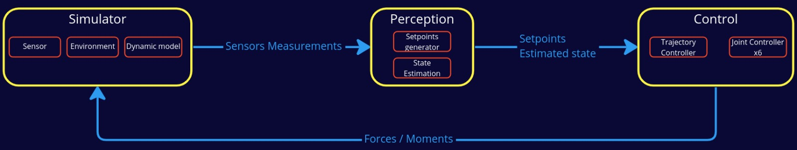

# General Info

This repository contains a robotic arm example for CITROS integration.
The robotic arm model and configuration was imported from [this](https://github.com/dvalenciar/robotic_arm_environment) Github project.

# About the example

This example simulate [Doosan a0912](https://www.doosanrobotics.com/en/products/series/a0912) robotics arm in ROS2-Gazebo environment. 

# Installation

1. Clone this repository:

        git clone git@github.com:lulav/citros_example_robotic_arm.git

2. in VSCode, open the repository inside the devcontainer with: `open inside container`. All the installation process is automatic with the [install script](.devcontainer/install.sh) that runs after the dockerfile is being built.

# Run

**RECOMMENDED** 
There are pre-configured workspace [tasks](https://www.allisonthackston.com/articles/vscode-tasks.html) for building and running the simulation.
Create a shortcut for task-running and select the desired option.

If you prefer to run manually with ros2-cli:

Run Gazebo GUI:

        ros2 launch my_doosan_pkg my_doosan_gazebo_controller.launch.py

Run Headless:

        ros2 launch my_doosan_pkg my_doosan_gazebo_controller.launch.py headless:=True

